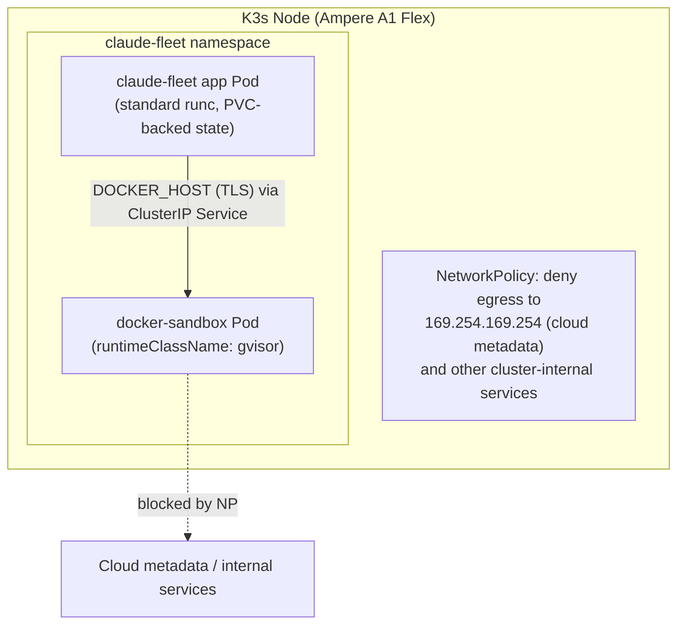

# Secure K3s Deployment

This documents the recommended production deployment of Claude Fleet on a K3s
cluster (target: Oracle Cloud Ampere A1 Flex / ARM64 VM shapes), including how
to safely give spawned agent sessions the ability to run Docker commands of
their own — without giving them a path to root on the host.

**Status:** fully wired. The app reads `DOCKER_HOST` / `DOCKER_TLS_VERIFY` /
`DOCKER_CERT_PATH` (config.py, same names as Docker's own client env vars —
exactly what the app Pod manifest in step 6 already sets) and injects them
into every spawned session via `tmux new-session -e`. Setting those three
values (or leaving them unset, the default) is the only step needed to turn
this on or off — no other code changes required.

## Why this isn't "just add `--privileged: true`"

A natural first instinct — run a `docker:dind-rootless` container with
`privileged: true` inside a K3s Pod — does **not** provide the isolation it
looks like it does. K3s's bundled containerd runs as **root** on the host by
default. A `privileged: true` container scheduled by a root-full container
runtime is granted the full set of Linux capabilities, direct host device
access, and disabled seccomp/AppArmor confinement — regardless of what
`runAsUser` is set to. None of the well-known container-escape techniques
(e.g. the cgroups `release_agent` breakout, [CVE-2022-0492](https://nvd.nist.gov/vuln/detail/CVE-2022-0492))
require the process to be UID 0 inside the container to reach real root on
the node. This is exactly why Kubernetes' own
[Pod Security Standards](https://kubernetes.io/docs/concepts/security/pod-security-standards/)
forbid `privileged: true` under both the `baseline` and `restricted` profiles.

The "rootless Docker inside rootless Docker" reasoning genuinely is sound —
but only when the *outer* Docker daemon itself never has host root to begin
with (e.g. a rootless dockerd running directly on a bare host). K3s's
containerd doesn't meet that condition, so the safety argument doesn't
transfer.

## The corrected architecture: gVisor-sandboxed Docker, as a separate Pod

[gVisor](https://gvisor.dev) (`runsc`) intercepts every syscall a sandboxed
process makes through a user-space reimplementation of the Linux kernel. Even
a genuine kernel 0-day inside the sandbox doesn't reach the real host kernel —
a materially stronger guarantee than namespace-only isolation, which is why
this is the right choice for a "treat agents as fully untrusted" threat model.

Two things drove the specific shape below:

- **`runtimeClassName` is a Pod-level setting**, not a per-container one — so
  the sandboxed Docker daemon must be its **own Pod**, not a sidecar next to
  the app container (a sidecar would force gVisor onto the app container too,
  or vice versa, for no benefit).
- **Oracle Ampere A1 Flex VM shapes don't support nested virtualization**,
  which rules out gVisor's KVM platform and Kata Containers. gVisor's
  `ptrace`/`systrap` platform needs no nested virt — it works on any Linux
  host — so that's the platform used throughout.



## 1. Node preparation: install gVisor

Official prebuilt binaries exist for ARM64 as a production platform — no
building from source required ([gVisor install docs](https://gvisor.dev/docs/user_guide/install/)):

```sh
sudo apt-get update && sudo apt-get install -y apt-transport-https ca-certificates gnupg curl
curl -fsSL https://gvisor.dev/archive.key | sudo gpg --dearmor -o /usr/share/keyrings/gvisor-archive-keyring.gpg
echo "deb [signed-by=/usr/share/keyrings/gvisor-archive-keyring.gpg] https://storage.googleapis.com/gvisor/releases release main" \
  | sudo tee /etc/apt/sources.list.d/gvisor.list
sudo apt-get update && sudo apt-get install -y runsc
```

Requires Linux kernel 4.14.77+ — any current Ubuntu/Oracle Linux cloud image
qualifies.

## 2. Register gVisor as a K3s containerd runtime

K3s regenerates `containerd`'s config on every start, so you cannot edit
`config.toml` directly — you edit the **template** it renders from instead.
Create `/var/lib/rancher/k3s/agent/etc/containerd/config.toml.tmpl` on every
node that should support gVisor:

The `docker-sandbox` Pod needs specific `runsc` flags to let its Docker daemon
work (`--net-raw`, `--allow-packet-socket-write` — see step 5), passed via a
`ConfigPath` to a separate `runsc.toml`, so set both up together:

```toml
{{ template "base" . }}

[plugins."io.containerd.cri.v1.runtime".containerd.runtimes.gvisor]
  runtime_type = "io.containerd.runsc.v1"
[plugins."io.containerd.cri.v1.runtime".containerd.runtimes.gvisor.options]
  TypeUrl = "io.containerd.runsc.v1.options"
  ConfigPath = "/etc/containerd/runsc.toml"
```

```toml
# /etc/containerd/runsc.toml -- flag = "value" becomes --flag="value"
[runsc_config]
  net-raw = "true"
  allow-packet-socket-write = "true"
```

(`io.containerd.cri.v1.runtime` is the plugin path for containerd 2.x, which
current K3s releases bundle. If your K3s is old enough to still be on
containerd 1.7, use `io.containerd.grpc.v1.cri` instead — check
`k3s --version` / `containerd --version` on the node if unsure.)

Restart k3s (`systemctl restart k3s` on servers, `k3s-agent` on agents) to
pick it up.

## 3. RuntimeClass

```yaml
apiVersion: node.k8s.io/v1
kind: RuntimeClass
metadata:
  name: gvisor
handler: gvisor
```

## 4. Namespace, Pod Security, and NetworkPolicy

```yaml
apiVersion: v1
kind: Namespace
metadata:
  name: claude-fleet
  labels:
    pod-security.kubernetes.io/enforce: baseline
    pod-security.kubernetes.io/warn: restricted
---
apiVersion: networking.k8s.io/v1
kind: NetworkPolicy
metadata:
  name: deny-metadata-and-egress
  namespace: claude-fleet
spec:
  podSelector: {}
  policyTypes: ["Egress"]
  egress:
    # DNS
    - to: [] # tighten to kube-dns pod/namespace selector in production
      ports:
        - { protocol: UDP, port: 53 }
        - { protocol: TCP, port: 53 }
    # Everything else EXCEPT the cloud metadata endpoint and RFC1918 ranges.
    # Kubernetes NetworkPolicy has no explicit "deny" list -- express this as
    # an allow-all-except via `except`, and add explicit allows for the git
    # hosts / Anthropic API / registries you actually need.
    - to:
        - ipBlock:
            cidr: 0.0.0.0/0
            except:
              - 169.254.169.254/32   # cloud instance metadata
              - 10.0.0.0/8
              - 172.16.0.0/12
              - 192.168.0.0/16
      ports:
        - { protocol: TCP, port: 443 }
```

Only `baseline` Pod Security is enforced (not `restricted`) because the
`docker-sandbox` Pod needs elevated capabilities *within* its own gVisor
sandbox (that's the entire point — gVisor intercepts them before they reach
the host kernel) — `restricted` would block that at admission time. The app
Pod itself should still run `restricted`-compatible (non-root, no added
capabilities); enforce that at the Pod spec level even though the namespace
only mandates `baseline`.

## 5. The sandboxed Docker daemon Pod

Following gVisor's own [Docker-in-gVisor](https://gvisor.dev/docs/tutorials/docker-in-gvisor/)
recipe — the specific flags below are required for dockerd to function inside
the sandbox:

```yaml
apiVersion: apps/v1
kind: Deployment
metadata:
  name: docker-sandbox
  namespace: claude-fleet
spec:
  replicas: 1
  selector:
    matchLabels: { app: docker-sandbox }
  template:
    metadata:
      labels: { app: docker-sandbox }
    spec:
      runtimeClassName: gvisor
      # Optional extra layer: Kubernetes-native user namespaces
      # (hostUsers: false), independent of gVisor and NOT required for the
      # sandbox to work -- gVisor's own syscall interception is what actually
      # isolates this Pod. Only add it if your K3s's Kubernetes version
      # supports it (beta in 1.30+, GA in 1.36+); check `kubectl version`
      # first, since setting it on an unsupporting version can fail admission.
      # hostUsers: false
      containers:
        - name: dockerd
          image: docker:27-dind
          args:
            - --iptables=false
            - --ip6tables=false
            - --tls=true
            - --tlscert=/certs/server/cert.pem
            - --tlskey=/certs/server/key.pem
            - --tlsverify
            - --tlscacert=/certs/ca.pem
          # net-raw / allow-packet-socket-write are set node-wide via
          # runsc.toml (step 2) -- nothing extra needed on this Pod for that.
          resources:
            limits: { memory: "4Gi", cpu: "2" }
            requests: { memory: "1Gi", cpu: "500m" }
          volumeMounts:
            - { name: docker-storage, mountPath: /var/lib/docker }
            - { name: docker-certs, mountPath: /certs, readOnly: true }
      volumes:
        - name: docker-storage
          emptyDir: {}   # ephemeral by design: agents' inner images/containers
                         # should not persist across sandbox restarts
        - name: docker-certs
          secret: { secretName: docker-sandbox-tls }
---
apiVersion: v1
kind: Service
metadata:
  name: docker-sandbox
  namespace: claude-fleet
spec:
  selector: { app: docker-sandbox }
  ports:
    - { port: 2376, targetPort: 2376 }
---
apiVersion: networking.k8s.io/v1
kind: NetworkPolicy
metadata:
  name: docker-sandbox-ingress
  namespace: claude-fleet
spec:
  podSelector: { matchLabels: { app: docker-sandbox } }
  policyTypes: ["Ingress"]
  ingress:
    - from:
        - podSelector: { matchLabels: { app: claude-fleet } }
      ports:
        - { port: 2376, protocol: TCP }
```

Notes:
- **TLS is required here**, unlike the PDF's same-pod/localhost approach —
  this daemon's control port now crosses the pod network, so it must be both
  encrypted and client-authenticated (`--tlsverify`). Generate the CA/server/
  client cert pairs with `dockerd`'s own
  [TLS setup guide](https://docs.docker.com/engine/security/protect-access/)
  and store the server pair as the `docker-sandbox-tls` Secret referenced
  above; the client pair goes to the app Pod (see below).
- The `docker-sandbox-ingress` NetworkPolicy is the second layer: even with
  valid client certs, only Pods labeled `app: claude-fleet` can reach it.
- `emptyDir` for Docker's storage is intentional — an agent's inner containers
  and pulled images shouldn't survive a sandbox Pod restart; treat it as
  disposable compute, not state.
- The `--net-raw` / `--allow-packet-socket-write` `runsc` flags gVisor's own
  Docker tutorial calls for are set node-wide in step 2's `runsc.toml`, not
  per-Pod — every Pod scheduled with `runtimeClassName: gvisor` on that node
  picks them up automatically.

## 6. The app Pod

```yaml
apiVersion: apps/v1
kind: Deployment
metadata:
  name: claude-fleet
  namespace: claude-fleet
spec:
  replicas: 1
  selector:
    matchLabels: { app: claude-fleet }
  template:
    metadata:
      labels: { app: claude-fleet }
    spec:
      containers:
        - name: app
          image: ghcr.io/mpavelka/claude-fleet:latest
          securityContext:
            runAsNonRoot: true
            runAsUser: 1000
            allowPrivilegeEscalation: false
            capabilities: { drop: ["ALL"] }
          env:
            - name: DOCKER_HOST
              value: tcp://docker-sandbox.claude-fleet.svc.cluster.local:2376
            - name: DOCKER_TLS_VERIFY
              value: "1"
            - name: DOCKER_CERT_PATH
              value: /certs/client
            - name: FLEET_SECRET_KEY
              valueFrom: { secretKeyRef: { name: claude-fleet-secrets, key: fleet-secret-key } }
            - name: FLEET_AUTH_TOKEN
              valueFrom: { secretKeyRef: { name: claude-fleet-secrets, key: auth-token } }
          resources:
            limits: { memory: "2Gi", cpu: "2" }
            requests: { memory: "512Mi", cpu: "250m" }
          volumeMounts:
            - { name: data, mountPath: /data }
            - { name: docker-client-certs, mountPath: /certs/client, readOnly: true }
          ports:
            - { containerPort: 8700 }
      volumes:
        - name: data
          persistentVolumeClaim: { claimName: claude-fleet-data }
        - name: docker-client-certs
          secret: { secretName: docker-sandbox-client-tls }
---
apiVersion: v1
kind: PersistentVolumeClaim
metadata:
  name: claude-fleet-data
  namespace: claude-fleet
spec:
  accessModes: ["ReadWriteOnce"]
  resources: { requests: { storage: 10Gi } }
---
apiVersion: v1
kind: Service
metadata:
  name: claude-fleet
  namespace: claude-fleet
spec:
  selector: { app: claude-fleet }
  ports:
    - { port: 8700, targetPort: 8700 }
```

`FLEET_SECRET_KEY` and `FLEET_AUTH_TOKEN` come from a `Secret` (`kubectl
create secret generic claude-fleet-secrets --from-literal=fleet-secret-key=...
--from-literal=auth-token=...`), never baked into the image or committed.

## 7. Exposing the UI

K3s ships Traefik by default. Terminate TLS there and gate access with an
`IngressRoute` + `BasicAuth` (or `ForwardAuth` if you have an existing IdP) —
this replaces the standalone Caddy reverse proxy documented in the main
README for a non-Kubernetes deployment; the app itself is unchanged (still
binds `0.0.0.0:8700`, still checks the optional `X-Auth-Token` header as
defense-in-depth). See [Traefik's Kubernetes CRD docs](https://doc.traefik.io/traefik/reference/routing-configuration/kubernetes/crd/http/middleware/basicauth/)
for the exact `Middleware`/`IngressRoute` shape.

## 8. Resource quotas (applies regardless of runtime)

Bound both Pods so a runaway agent (infinite loop, giant image pull) can't
starve the node — already reflected in the manifests above
(`resources.limits`/`requests`), following the same reasoning as the original
PDF's advice, which was correct on this point.

## How spawned sessions actually get wired to the sandbox

`manager.py` reads `config.DOCKER_HOST` / `config.DOCKER_TLS_VERIFY` /
`config.DOCKER_CERT_PATH` (populated from the identically-named env vars —
see step 6's app Pod manifest, which already sets exactly these three) and
passes them to every `tmux new-session` call via `-e KEY=VALUE`, for both a
fresh `spawn()` and a `rerun()` of an orphaned instance. Any `docker` command
a spawned session runs then transparently talks to the sandboxed daemon.

This needed to be more deliberate than "the container's env vars are already
there, so tmux sessions must inherit them": tmux sessions share **one**
server process, started implicitly by whichever `new-session` call happens
to run first, and that server caches a *global* environment from the process
that started it — a later session does **not** simply inherit the environment
of whatever process spawns it. Confirmed empirically: a session created after
explicitly unsetting `DOCKER_HOST` in the calling shell still saw a value set
before the tmux server first started. `-e` is the only reliable per-session
override, so all three vars are passed on **every** `new-session` call
regardless of configuration — set to their real values when configured, or to
`""` (equivalent to unset for the `docker` CLI) when not. Leaving any of them
out when unconfigured would risk a stale value leaking in from whatever the
tmux server's environment happened to be when it first started, silently
undermining "Docker access is disabled" as a security boundary.

The **Environment** status widget also gained a **sandboxed docker** check
(`health.py`), distinct from the existing local-`docker`-CLI check: `absent`
when `DOCKER_HOST` isn't configured (the normal, unremarkable default),
`ok`/`warn` based on whether the configured target actually responds when it
is.
